# HICTOP Swapper Reverse-Engineering Plan

## Problem statement

[HICTOP Swapper](http://www.hictopswapper.com/) turns one or more sliced Bambu `.gcode.3mf` plates into a single continuous-print `.3mf` with plate-change gcode. On A1 with **multiple AMS**, exported jobs fail to map AMS colors correctly.

Sample artifacts already in-repo:

- Input: [`hictop input/CAD Coin Hong Kong Version_plate_1.gcode.3mf`](hictop%20input/CAD%20Coin%20Hong%20Kong%20Version_plate_1.gcode.3mf) (~16MB zip, plate gcode ~53MB)
- Output: [`hictop output/CAD Coin Hong Kong Version.swap.gcode.3mf`](hictop%20output/CAD%20Coin%20Hong%20Kong%20Version.swap.gcode.3mf) (~37MB zip, plate gcode ~107MB ≈ 2× input)

Note: colors differ slightly between these two files (`#A4DAE6` vs `#0085D5`, 8 vs 9 filament slots), so treat them as “same job shape” evidence, not a perfect byte-level pair. Prefer regenerating a clean A/B pair during RE.

## What the website actually is

Client-side only (no server transform). Core assets:

| Asset                  | Role                                                  |
| ---------------------- | ----------------------------------------------------- |
| `res/test.js` (~21KB)  | Import queue, stats, export/concat, MD5               |
| `res/jszip_m.js`       | Read/write `.3mf` (ZIP)                               |
| `res/spark-md5.min.js` | `plate_1.gcode.md5`                                   |
| Inline HTML radio      | Printer-specific **plate-swap gcode** (`replace_txt`) |

```mermaid
flowchart LR
  import3mf[Import gcode.3mf] --> parseMeta[Parse model_settings + slice_info]
  parseMeta --> queue[Playlist queue + repeats]
  queue --> concat[Concatenate plate gcodes]
  concat --> inject[Inject plate-swap gcode after claim_speed_level]
  inject --> rewriteMeta[Rewrite model_settings / slice_info / project_settings]
  rewriteMeta --> md5[MD5 plate_1.gcode]
  md5 --> export3mf[Export single-plate 3mf]
```

### Confirmed transform behavior (from `test.js` + sample diff)

1. Read each selected plate’s `Metadata/plate_N.gcode`.
2. Optionally inject printer swap gcode after last `set_gcode_claim_speed_level : 0` (`update_gcode`).
3. Concatenate plates × repeats × loops into one `Metadata/plate_1.gcode`.
4. Copy `project_settings.config` from the source file with the **highest used filament slot** (`ams_max_file_id`).
5. Replace `model_settings.config` with a **hardcoded 1-plate template** that drops AMS fields.
6. Collapse `slice_info` to one plate; rebuild filament nodes as `<filament id used_m used_g>` only (lose color/type/tray).
7. Intended AMS boundary cleanup scans `M620 S...` and should comment adjacent `M620 S255` unload blocks when filament continues — but `disable_gcode_line2()` is currently a **no-op** (`return e`).

### High-probability AMS failure points

These are the primary RE/fix targets for multi-AMS color mismatch:

1. **Dropped plate AMS maps** — input has `filament_map_mode` / `filament_maps` / `filament_volume_maps` in `model_settings`; output template removes them.
2. **Degraded `slice_info` filaments** — lose `color`, `type`, `tray_info_idx`, `group_id`; Bambu UI/printer may re-bind AMS by incomplete metadata.
3. **`filament_map` all `1`s** — gcode/project settings map every logical filament to AMS unit 1 (`1,1,1,...`). Multi-AMS needs maps spanning AMS 1/2 (and beyond).
4. **Naive full-plate concat** — second plate keeps full `HEADER_BLOCK` + `MACHINE_START` + `M620 M ;enable remap`, so AMS remap/startup runs mid-job.
5. **Broken S255 disable** — plate boundaries still do full unload (`M620 S255` / `T255`) even when next plate continues same filament IDs.
6. **Settings source selection** — `project_settings` taken from one input file only; not merged for multi-file / multi-AMS color schemes.

## Reverse-engineering phases

### Phase 0 — Capture clean golden fixtures

- Re-export from the live site using **one known input twice** (rep=2) and save as `fixtures/same-plate-x2.*`.
- Also export a true multi-AMS project where filaments map across AMS1 + AMS2.
- Record printer radio choice (A1 swap gcode), repeats, loops.

### Phase 1 — Freeze website source

- Mirror `index.html`, `res/test.js`, jszip, spark-md5, CSS.
- Pretty-print + annotate `test.js` functions: `handleFile`, `export_3mf`, `update_gcode`, `update_filament_usage`, AMS S255 logic.
- Extract A1 plate-swap gcode block from the HTML radio `value=...`.

### Phase 2 — 3MF schema inventory

Document every path and which fields the tool reads vs rewrites vs leaves untouched:

- Read: `Metadata/model_settings.config`, `slice_info.config`, plate gcode, thumbnails
- Rewrite: `plate_1.gcode`, `plate_1.gcode.md5`, `model_settings.config`, `slice_info.config`, `project_settings.config` (copied)
- Untouched (and possibly stale): `plate_1.json`, `filament_sequence.json`, previews, `3D/3dmodel.model`

### Phase 3 — Gcode seam analysis

Diff input vs output around:

- First plate end → swap injection → second plate start
- All `M620` / `M621` / `Tnnn` / `M620 M`
- Header `; filament_map`, `; filament_colour`, `; extruder_ams_count`
- Whether second `MACHINE_START` / remap should be stripped for continuous print

### Phase 4 — AMS mapping model

Decode and document:

- `filament_map` / `filament_maps` meaning (logical filament → AMS unit)
- `extruder_ams_count` format (`1#0|4#0`)
- Relationship between slicer filament IDs (`1,3,6`), 0-based `filament_ids` in `plate_1.json`, and AMS tray slots
- How Bambu Studio/printer resolves color when metadata disagrees with live AMS RFID

### Phase 5 — Reproduce failure + prove fix hypotheses

Minimal experiments (in order):

1. Restore `filament_maps` + `filament_map_mode` into exported `model_settings`.
2. Preserve full `slice_info` filament attributes (color/type/tray).
3. Strip second plate’s machine-start/remap; keep only motion body + necessary toolchanges.
4. Re-enable real `disable_gcode_line` for intermediate `M620 S255` when adjacent plates share filament IDs.
5. For multi-AMS fixtures, rewrite `filament_map` to correct AMS unit indices instead of all `1`.

Success criteria: printer/Bambu UI shows correct AMS tray colors for all used filaments across both plates; no wrong-slot pulls between plate swaps.

## Feature sets for Kimi (I/O + components)

Work packages are intentionally small so Kimi can implement/test each in isolation.

### F1 — `3mf_io`

- **Input:** `.gcode.3mf` bytes
- **Output:** structured package `{files: Map<path,bytes|text>, plates[], filaments[]}`
- **Component:** ZIP open/list/read/write via JSZip or Python `zipfile`
- **Acceptance:** round-trip unpack/repack without changing unread entries

### F2 — `metadata_parser`

- **Input:** `model_settings.config`, `slice_info.config`, `project_settings.config`, `plate_N.json`, `filament_sequence.json`
- **Output:** typed objects: plates, filament usage, `filament_maps`, colors, AMS counts
- **Component:** XML + JSON parsers
- **Acceptance:** fixtures match known sample field values (`filament: 1,3,6`, maps, colors)

### F3 — `gcode_analyzer`

- **Input:** plate gcode text
- **Output:** header stats, time estimate, filament list, all `M620*` index list, claim-speed-level offsets, machine-start/end spans
- **Component:** streaming regex/index scanner (files are 50–100MB+)
- **Acceptance:** count/`M620 S255` positions match golden fixtures

### F4 — `plate_swap_injector` (printer profiles)

- **Input:** plate gcode + printer profile id (`A1`, …) + swap gcode snippet
- **Output:** gcode with swap block inserted after last `set_gcode_claim_speed_level : 0`
- **Component:** port of `update_gcode` + extracted HTML radio snippets
- **Acceptance:** byte-identical injection locus vs live site for same profile

### F5 — `plate_concatenator`

- **Input:** ordered list of plate gcodes, per-plate repeats, global loops
- **Output:** single concatenated gcode blob
- **Component:** sequential join; later option to strip redundant second headers/starts
- **Acceptance:** size ≈ sum(inputs); seam markers detectable

### F6 — `ams_boundary_cleaner`

- **Input:** concatenated gcode + detected `M620 S` events
- **Output:** gcode with disabled intermediate unload/reload when filament continuity rule matches
- **Component:** correct implementation of intended `disable_gcode_line` / `disable_gcode_block` (replace current no-op)
- **Acceptance:** unit tests on synthetic `M620 S2 / S255 / S2` sequences

### F7 — `ams_map_preserver` (bugfix core)

- **Input:** source package metadata + used filament set
- **Output:** corrected `model_settings`, `slice_info`, and optionally synced gcode header comments / `project_settings.filament_map*`
- **Rules to implement first:**
  - Keep `filament_map_mode`, `filament_maps`, `filament_volume_maps`
  - Keep filament `color`/`type`/`tray_info_idx`
  - Do not force all maps to AMS `1` when source maps differ
  - Prefer explicit map from source plate over “highest slot file” heuristics when conflicting
- **Acceptance:** multi-AMS fixture retains cross-AMS maps after export

### F8 — `export_packager`

- **Input:** rewritten metadata + final gcode
- **Output:** downloadable `.gcode.3mf` + matching `plate_1.gcode.md5`
- **Component:** DEFLATE zip writer + chunked MD5 (2MiB chunks, SparkMD5-compatible)
- **Acceptance:** MD5 matches independent hasher; Bambu opens file

### F9 — `cli_or_web_ui` (thin shell)

- **Input:** user files + printer profile + repeats/loops
- **Output:** calls F1–F8 pipeline
- **Component:** Node/Python CLI first (easier tests); optional later web UI mirroring HICTOP
- **Acceptance:** regenerates sample “2× plate” job and passes AMS checks from F7

### F10 — `diff_harness` (Kimi QA)

- **Input:** expected vs actual 3mf
- **Output:** structured report of metadata/gcode seam/AMS-map deltas
- **Component:** fixture-driven tests under `tests/fixtures/`
- **Acceptance:** catches regressions on dropped `filament_maps` and stripped filament colors

## Suggested Kimi assignment order

1. F1 + F2 + F10 (understand package + diffs)
2. F3 + F5 + F4 (reproduce concat/swap behavior)
3. F7 + F6 (AMS correctness — main goal)
4. F8 + F9 (ship usable tool)

## Repo deliverables (after plan approval)

- `vendor/hictopswapper/` mirrored site assets + annotated `test.js`
- `docs/ams-mapping.md` field dictionary
- `src/` modules matching F1–F9
- `tests/fixtures/` clean same-plate-x2 + multi-AMS A/B pairs
- Working CLI that exports AMS-safe continuous-plate 3mf for A1
